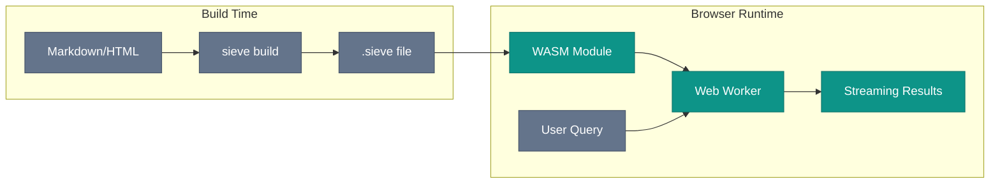
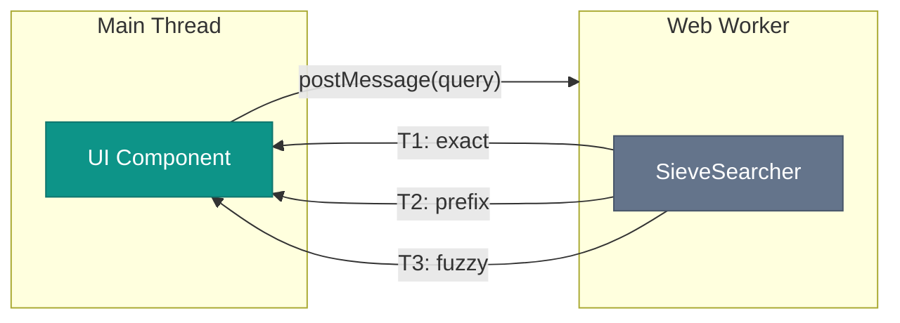
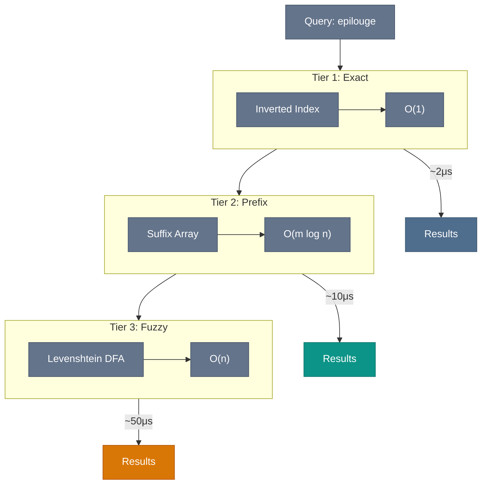

# Architecture

## Design Principles

Three ideas shape every technical decision:

1. **Precompute everything possible:** Build-time work is free; query-time work is expensive. If you can compute it once, do it at index time.
2. **Compact binary format:** Smaller indices load faster and cache better. Every byte in `.sieve` files earns its place.
3. **Proven correctness:** Formal verification catches bugs that tests miss. The field hierarchy is mathematically proven, not just tested.

The goal: instant search in browsers without sacrificing accuracy or features. A ~150KB WASM bundle shouldn't feel like a compromise.

---

## Visual Overview

### Build and Runtime Flow



### Web Worker Integration

Search runs in a dedicated Web Worker to keep the main thread free. The UI stays responsive at 60fps even during complex fuzzy searches.



**Why Web Workers?**
- **Non-blocking**: Heavy computation doesn't freeze the UI
- **Streaming**: Results arrive progressively as each tier completes
- **Isolation**: WASM memory is sandboxed in the worker

### Three-Tier Search Pipeline



---

## System Overview

```
BUILD TIME                                   RUNTIME (WASM)
──────────────                               ──────────────
JSON Payload                                 .sieve binary
    │                                             │
    ▼                                             ▼
┌───────────────────────────┐              ┌────────────────────────────┐
│ Index Construction        │              │ Search Execution           │
│                           │              │                            │
│ 1. Tokenize + normalize   │              │ 1. Parse query             │
│ 2. Build inverted index   │              │ 2. Exact match O(1)        │
│ 3. Build vocab SA         │              │ 3. Prefix match O(log k)   │
│ 4. Precompute Lev DFA     │              │ 4. Fuzzy match (DFA)       │
│ 5. Encode to binary       │              │ 5. Score + rank            │
│                           │              │ 6. Return results          │
└───────────────────────────┘              └────────────────────────────┘
          │                                             │
          ▼                                             ▼
     .sieve file                                 SearchResult[]
     (~15% overhead                              with section_ids
      vs raw text)                               for deep linking
```

---

## Parallel Build (MapReduce)

The `sieve index` CLI uses a MapReduce-style architecture for maximum throughput on multi-core machines:

```
INPUT                          MAP PHASE                         REDUCE PHASE
─────                          ─────────                         ────────────

manifest.json
     │
     ├─────┬─────┬─────┐
     ▼     ▼     ▼     ▼
┌───────┬───────┬───────┬─────────┐
│ 0.json│ 1.json│ 2.json│  N.json │  Document files
└───┬───┴───┬───┴───┬───┴────┬────┘
    │       │       │        │
    ▼       ▼       ▼        ▼
┌───────────────────────────────────────────────────────────────┐
│ PHASE 1: Parallel Document Loading (Rayon par_iter)           │
│                                                               │
│  Thread 1    Thread 2    Thread 3    Thread N                 │
│  ────────    ────────    ────────    ────────                 │
│  read JSON   read JSON   read JSON   read JSON                │
│  parse       parse       parse       parse                    │
│  validate    validate    validate    validate                 │
└───────────────────────────────────────────────────────────────┘
                          │
                          ▼
                   Vec<Document>
                   (sorted by ID)
                          │
                          ▼
┌─────────────────────────────────────────────────────────────────┐
│ PHASE 2: Index Construction                                     │
│                                                                 │
│  ┌─────────────────────────────────────────────────────────┐    │
│  │ Shared: Arc<ParametricDFA> (built once, ~1.2KB)         │    │
│  └─────────────────────────────────────────────────────────┘    │
│                                                                 │
│  All Documents                                                  │
│  ─────────────                                                  │
│       │                                                         │
│       ▼                                                         │
│  build_fst_index()   ← Verified suffix array construction       │
│       │                                                         │
│       ▼                                                         │
│  BinaryLayer::build  ← Encode with embedded WASM                │
└─────────────────────────────────────────────────────────────────┘
                          │
                          ▼
                   BuiltIndex
                          │
┌─────────────────────────────────────────────────────────────────┐
│ PHASE 3: Sequential Output (single thread)                      │
│                                                                 │
│  hash = crc32(index.bytes)                                      │
│  write "index-{hash}.sieve"     ← WASM embedded                 │
│                                                                 │
│  write sieve-loader.js          ← JS loader for browser         │
│  write sieve-loader.js.map      ← Source map (for debugging)    │
│                                                                 │
│  if --demo:                                                     │
│    write demo.html              ← Demo page                     │
└─────────────────────────────────────────────────────────────────┘
                          │
                          ▼
OUTPUT
──────
output/
├── index-a1b2c3d4.sieve      ← Self-contained (index + WASM)
├── sieve-loader.js           ← Extracts WASM from .sieve
├── sieve-loader.js.map       ← Source map (for debugging)
└── demo.html                 ← (if --demo)
```

### Why This Architecture

| Phase | Parallelization | Bottleneck |
|-------|-----------------|------------|
| Document loading | Per-file | I/O bound (SSD throughput) |
| Index building | Single index | CPU bound (suffix array construction) |
| Output writing | Sequential | I/O bound (negligible) |

The Levenshtein DFA is built once (~1.2KB precomputed automaton with ~70 states). The index uses the verified `build_fst_index()` function that guarantees suffix array sortedness and index well-formedness.

---

## Binary Format (`.sieve` v7)

<aside class="skip-note">

*Deep dive into the wire format. [Skip to Search Algorithms](#search-algorithms) if you just want to understand query execution.*

</aside>

The format is designed for memory-mapped loading with minimal parsing. Validation happens once at load time; after that, all operations are direct pointer arithmetic.

**v7 is self-contained** - a single `.sieve` file includes everything needed: the search index, document metadata, and the WASM runtime. No separate JS/WASM files needed.

### Why Embed WASM?

Each `.sieve` file embeds its own WASM runtime to avoid backwards compatibility concerns.

The binary format evolves: new compression schemes, additional metadata fields, changed section layouts. If the WASM runtime were separate, every format change would require either:
- Maintaining multiple runtime versions
- Coordinating runtime and index upgrades across deployments
- Version detection logic to load the right runtime

By embedding the runtime, each index is self-contained and frozen in time. A v7 index carries v7-compatible code. A future v8 index carries v8-compatible code. They coexist without conflict. Old indexes keep working indefinitely. New indexes use new features. No migration required.

<aside class="callout callout-neutral">
<div class="callout-title">Size Tradeoff</div>

~150KB (gzipped) added to each index. For most sites with a single search index, this is negligible. If you need multiple indexes without duplicated WASM, [file an issue](https://github.com/harryzorus/sieve/issues).

</aside>

### Acknowledgments

Several techniques in this format are inspired by [Apache Lucene](https://lucene.apache.org/), the gold standard for search engine internals:

- **Block PFOR compression** for posting lists (Lucene 4.0+)
- **Skip lists** for large posting traversal (Lucene's multi-level skips)
- **Varint encoding** for compact integer storage
- **Term dictionary** with binary search (similar to Lucene's BlockTree)

The suffix array and Levenshtein DFA components are Sieve-specific additions that enable substring and fuzzy search capabilities beyond traditional inverted indexes.

<aside class="sidenote">

Lucene's approach prioritizes server-side search with large heaps and persistent storage. Sieve inverts this for client-side WASM: everything precomputed, everything in one memory-mapped blob, no runtime allocations during search.

</aside>

### Layout

```
┌─────────────────────────────────────────────────────────────────┐
│ HEADER (52 bytes)                                               │
│   magic: "SIFT" (4 bytes) ────────────── Validates file type    │
│   version: u8 = 7                                               │
│   flags: u8 ──────────────────────────── HAS_SKIP_LISTS, etc.   │
│   doc_count: u32                                                │
│   term_count: u32                                               │
│   vocab_len, sa_len, postings_len, skip_len: u32                │
│   section_table_len, lev_dfa_len, docs_len, wasm_len: u32       │
│   dict_table_len: u32 ───────────────── Dictionary tables (v7)  │
│   reserved: 2 bytes                                             │
├─────────────────────────────────────────────────────────────────┤
│ VOCABULARY                                                      │
│   Length-prefixed UTF-8 strings, lexicographically sorted       │
│   Format: varint(len) + bytes[len]                              │
│   Binary search enables O(log k) term lookup                    │
├─────────────────────────────────────────────────────────────────┤
│ SUFFIX ARRAY                                                    │
│   varint(count)                                                 │
│   FOR-encoded (term_idx, char_offset) pairs                     │
│   Delta-encoded term_idx for compression                        │
│   Enables prefix search across entire vocabulary                │
├─────────────────────────────────────────────────────────────────┤
│ POSTINGS (Block PFOR, 128-doc blocks)                           │
│   For each term (in vocabulary order):                          │
│     varint(doc_freq)                                            │
│     varint(num_blocks)                                          │
│     For each block: PFOR-encoded deltas (128 docs)              │
│     varint(tail_count) + varint[tail_count] for remainder       │
│     varint[doc_freq] section_idx values (v6+)                   │
├─────────────────────────────────────────────────────────────────┤
│ SKIP LISTS (for terms with >1024 docs)                          │
│   Multi-level skip pointers for fast posting traversal          │
│   Enables O(log n) seeks within large posting lists             │
├─────────────────────────────────────────────────────────────────┤
│ SECTION TABLE (v6+)                                             │
│   Deduplicated section_id strings for deep linking              │
│   varint(count) + length-prefixed strings                       │
│   Postings reference these by index (0 = no section)            │
├─────────────────────────────────────────────────────────────────┤
│ LEVENSHTEIN DFA                                                 │
│   Precomputed parametric automaton (Schulz-Mihov 2002)          │
│   ~1.2KB for k=2 with transpositions                            │
│   Enables zero-CPU-cost fuzzy matching at query time            │
├─────────────────────────────────────────────────────────────────┤
│ DOCUMENTS                                                       │
│   varint(count)                                                 │
│   For each doc:                                                 │
│     type: u8 (0=page, 1=post)                                   │
│     title, excerpt, href: varint_len + utf8                     │
│     category, author: dictionary-indexed (v7)                   │
│     tags: array of dictionary indices (v7)                      │
├─────────────────────────────────────────────────────────────────┤
│ WASM (v7)                                                       │
│   Embedded WebAssembly runtime (sieve_bg.wasm)                  │
│   ~150KB gzipped, makes .sieve fully self-contained             │
│   Client-side loader extracts and instantiates                  │
├─────────────────────────────────────────────────────────────────┤
│ DICTIONARY TABLES (v7)                                          │
│   Parquet-style string deduplication for repeated fields        │
│   num_tables: u8 (4)                                            │
│   category_table: varint(count) + length-prefixed strings       │
│   author_table: varint(count) + length-prefixed strings         │
│   tags_table: varint(count) + length-prefixed strings           │
│   href_prefix_table: varint(count) + length-prefixed strings    │
│   Reduces wire size by ~45 bytes/doc for large indexes          │
├─────────────────────────────────────────────────────────────────┤
│ FOOTER (8 bytes)                                                │
│   crc32: u32 ────────────────────────── Over header + sections  │
│   magic: "TFIS" ─────────────────────── Validates complete file │
└─────────────────────────────────────────────────────────────────┘
```

### Block PFOR Compression

Posting lists use Block Patched Frame-of-Reference encoding (same as Lucene):

```
Block of 128 doc_id deltas:
  [5, 1, 3, 2, 1, ...]   ← Differences between consecutive doc_ids

PFOR encoding:
  min_delta: varint      ← Frame of reference (subtract from all)
  bits_per_value: u8     ← Bits needed for max(adjusted_deltas)
  packed_data: [u8; ...]  ← Bit-packed values

Example:
  Deltas: [10, 11, 12, 10, 11, 12, ...]  ← All values 10-12
  min_delta = 10
  bits_per_value = 2  ← Need 2 bits to represent 0, 1, 2
  Packed: 2 bits × 128 = 32 bytes (vs 512 bytes uncompressed)
```

For uniform distributions (common in rare terms), bits_per_value = 0 and no packed data is written.

### Varint Encoding

All variable-length integers use LEB128:

```
Value         Encoded
0             0x00
127           0x7F
128           0x80 0x01
16383         0xFF 0x7F
16384         0x80 0x80 0x01
```

Continuation bit (0x80) indicates more bytes follow. Maximum 10 bytes for u64.

---

## Search Algorithms

### Three-Tier Query Resolution

Queries pass through three tiers, stopping at the first that produces results:

```
Query: "auth"
    │
    ▼
┌───────────────────────────────────────────────────────────┐
│ TIER 1: Exact Match (O(1))                                │
│   Hash lookup in inverted index: "auth" → posting list    │
│   Returns immediately if found                            │
└───────────────────────────────────────────────────────────┘
    │ Not found
    ▼
┌───────────────────────────────────────────────────────────┐
│ TIER 2: Prefix Match (O(log k))                           │
│   Binary search vocabulary suffix array                   │
│   Find all terms starting with "auth*"                    │
│   → "authenticate", "authentication", "author"            │
└───────────────────────────────────────────────────────────┘
    │ Results or continue for fuzzy
    ▼
┌───────────────────────────────────────────────────────────┐
│ TIER 3: Fuzzy Match (O(vocabulary) but fast)              │
│   Traverse vocabulary with precomputed Levenshtein DFA    │
│   Find terms within edit distance k=2                     │
│   → "author" (d=1), "audit" (d=2)                         │
└───────────────────────────────────────────────────────────┘
```

### Vocabulary Suffix Array

Rather than a suffix array over the full text (expensive), Sieve uses a suffix array over the vocabulary - the unique terms:

```
Vocabulary: ["apple", "application", "apply", "banana"]

Suffix Array entries:
  (0, 0) → "apple"          Points to suffix of vocabulary[0]
  (0, 1) → "pple"
  (0, 2) → "ple"
  (1, 5) → "ation"          Points to suffix of vocabulary[1]
  (1, 0) → "application"
  ...

Sorted lexicographically by the suffix string.
Binary search finds all terms with a given prefix.
```

For a 100KB blog with 10K unique words, this is ~50K suffix entries (vs ~500K for full text). The vocabulary is typically 10-20% of the full text size.

### Levenshtein DFA (Schulz-Mihov 2002)

Traditional fuzzy search computes edit distance per-term at query time: O(query_len × term_len × vocabulary_size). Sieve precomputes a universal DFA at index time:

```
Parametric DFA Structure:
  ~70 states for k=2
  8 transitions per state (2^(k+1) character classes)
  ~1.2KB total

At query time:
  1. Compute character class for each input character:
     bit i = 1 if input matches query[position + i]
  2. Follow DFA transitions (single array lookup per character)
  3. Accept state indicates edit distance ≤ k

Result: O(term_len) per term, no distance computation
```

The DFA is query-independent - the same precomputed structure works for any query. Only character class computation depends on the actual query string.

### Scoring and Ranking

Results are ranked by a combination of field type and position:

```
Field Type Base Scores (Lean-verified):
  Title   = 100.0
  Heading =  10.0
  Content =   1.0

Position Boost (within field):
  Earlier matches get up to +0.5 bonus
  MaxBoost = 0.5

Field Type Dominance (mathematically proven):
  Title - MaxBoost > Heading + MaxBoost
  → 99.5 > 10.5 ✓

  Heading - MaxBoost > Content + MaxBoost
  → 9.5 > 1.5 ✓

This guarantees: ANY title match outranks ANY heading match,
regardless of position. The hierarchy is absolute, not heuristic.
```

---

## Index Types

Sieve supports multiple index configurations:

### Union Index (Default)

Separate indices for titles, headings, and content:

```
UnionIndex
├── docs: Vec<SearchDoc>          ← Shared metadata
├── titles: Option<HybridIndex>   ← Title text only
├── headings: Option<HybridIndex> ← Heading text only
└── content: Option<HybridIndex>  ← Body text only
```

Benefits:
- Faster search: smaller indices = fewer comparisons
- Source attribution: results indicate where match was found
- Early termination: can stop after finding title matches

### Hybrid Index

Each sub-index combines inverted + suffix array:

```
HybridIndex
├── inverted_index: HashMap<String, PostingList> ← O(1) exact
├── vocabulary: Vec<String>                      ← Sorted terms
├── vocab_suffix_array: Vec<(term_idx, offset)>  ← O(log k) prefix
└── docs, texts, field_boundaries                ← Metadata
```

---

## Deep Linking (Section IDs)

Search results include section IDs for navigation to specific headings:

```
Search result for "optimization" in document "/posts/rust-search":
  {
    href: "/posts/rust-search",
    section_id: "performance-optimization",  ← From FieldBoundary
    source: "heading"
  }

Frontend builds URL: /posts/rust-search#performance-optimization
```

Section IDs are stored in a deduplicated string table and referenced by index in postings:

```
Section Table: ["introduction", "setup", "performance-optimization"]

Posting entry:
  doc_id: 5
  section_idx: 3  ← Points to "performance-optimization"

Resolution:
  section_idx 0 = None (title, no anchor)
  section_idx N = section_table[N-1]
```

---

## Formal Verification

<aside class="skip-note">

*Proof engineering details. [Skip to WASM Compilation](#wasm-compilation) if you just need deployment info.*

</aside>

### Three-Layer Defense

```
┌─────────────────────────────────────────────────────────────────┐
│ LAYER 1: Lean Proofs                                            │
│   Mathematical specifications in lean/SearchVerified/           │
│   5 proven theorems, 18 axioms                                  │
│   If Lean builds, the spec is internally consistent             │
└─────────────────────────────────────────────────────────────────┘
                              │
                              ▼
┌─────────────────────────────────────────────────────────────────┐
│ LAYER 2: Type-Level Wrappers                                    │
│   ValidatedSuffixEntry, SortedSuffixArray, WellFormedIndex      │
│   Compile-time enforcement via newtype pattern                  │
│   Can't create invalid data without explicit unsafe             │
└─────────────────────────────────────────────────────────────────┘
                              │
                              ▼
┌─────────────────────────────────────────────────────────────────┐
│ LAYER 3: Runtime Contracts                                      │
│   debug_assert! checks in contracts.rs                          │
│   Zero cost in release builds                                   │
│   Catch invariant violations during development                 │
└─────────────────────────────────────────────────────────────────┘
```

### Key Proven Properties

| Property | Lean File | Rust Enforcement |
|----------|-----------|------------------|
| Title beats Heading | Scoring.lean | `check_field_hierarchy` |
| Heading beats Content | Scoring.lean | `check_field_hierarchy` |
| Suffix array sorted | SuffixArray.lean | `SortedSuffixArray` |
| Suffix entries valid | Types.lean | `ValidatedSuffixEntry` |
| Binary search correct | BinarySearch.lean | Property tests |
| Edit distance bounds | Levenshtein.lean | Property tests |

---

## WASM Compilation

The library compiles to WebAssembly with minimal dependencies:

```bash
wasm-pack build --target web --features wasm
```

### Size Optimization

| Technique | Impact |
|-----------|--------|
| `opt-level = 's'` | Optimize for size, not speed |
| `lto = true` | Whole-program optimization |
| `panic = 'abort'` | No unwinding, smaller binary |
| No `serde_json` in WASM | Cuts ~20KB |
| Precomputed DFA | ~1.2KB vs runtime construction |

Output: ~150KB gzipped (WASM + JS loader).

### JavaScript Loader

The `sieve-loader.js` is generated from TypeScript modules in `src/build/loader/`:

```
src/build/loader/
├── index.ts      # Public API: loadSieve, loadSieveSync
├── parser.ts     # .sieve parsing + CRC32 validation
├── searcher.ts   # SieveSearcher class wrapper
├── wasm-state.ts # Per-instance WASM state (heap, memory)
├── imports.ts    # wasm-bindgen import bindings
└── build.ts      # Bundles to target/loader/
```

Build with `cd src/build/loader && bun run build.ts`. Output goes to `target/loader/sieve-loader.js` (and `.map`), which is embedded in the Rust CLI via `include_str!`.

**Key features:**
- **Self-contained**: No external dependencies, all wasm-bindgen glue code inlined
- **Version isolation**: Multiple WASM versions coexist via per-instance state
- **CRC32 validation**: Recalculates checksum after stripping WASM from index

### JavaScript Interface

```typescript
// Load a .sieve file
async function loadSieve(url: string): Promise<SieveSearcher>;
function loadSieveSync(buffer: ArrayBuffer): SieveSearcher;

class SieveSearcher {
  search(query: string, limit?: number): SearchResult[];
  has_docs(): boolean;
  doc_count(): number;
  vocab_size(): number;
  has_vocabulary(): boolean;
  free(): void;  // Release WASM memory
}

interface SearchResult {
  title: string;
  excerpt: string;
  href: string;
  sectionId: string | null;  // For deep linking
}
```

---

## Performance Characteristics

### Time Complexity

| Operation | Complexity | Speed | Notes |
|-----------|------------|-------|-------|
| Index load | O(n) | <span class="complexity complexity-medium">~50ms</span> | Linear scan, one-time cost |
| Exact match | O(1) | <span class="complexity complexity-fast">~2μs</span> | Hash table lookup |
| Prefix match | O(log k + m) | <span class="complexity complexity-fast">~10μs</span> | k = vocabulary, m = matches |
| Fuzzy match | O(k × t) | <span class="complexity complexity-medium">~50μs</span> | k = vocabulary, t = avg term length |
| Posting intersection | O(min(n, m)) | <span class="complexity complexity-fast">~5μs</span> | Using skip lists for large lists |

### Space Complexity

| Component | Size | Notes |
|-----------|------|-------|
| Vocabulary | ~15% of text | Deduplicated, length-prefixed |
| Suffix array | ~4 bytes/suffix | Compressed term indices |
| Postings | ~2 bytes/posting | Block PFOR with deltas |
| Levenshtein DFA | ~1.2KB fixed | Independent of vocabulary |
| Skip lists | ~5% of large postings | Only for terms with >1024 docs |

Total index overhead: ~15-20% on top of document metadata.

---

## Related Documentation

- [Algorithms](./algorithms.md): Suffix arrays, Levenshtein automata, Block PFOR
- [Benchmarks](./benchmarks.md): Performance comparisons with other libraries
- [Integration](./integration.md): WASM setup, browser integration, TypeScript
- [Verification](./verification.md): Formal verification guide
- [Contributing](./contributing.md): How to contribute safely
